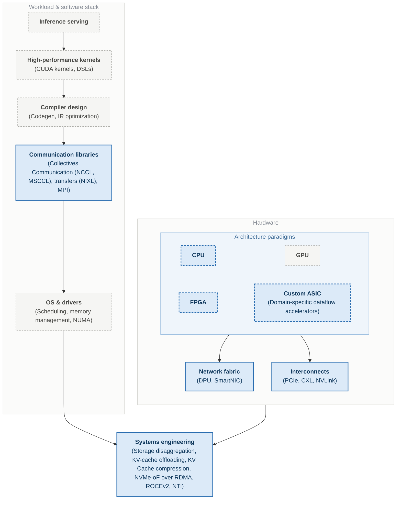

Hi 👋!

I am a Hardware Engineer at **[MangoBoost, Inc.](https://www.mangoboost.io/)**, where I work on scaling data center infrastructure — DPU system architecture and GPU-server workload analysis.

My work follows a single path: an application workload down to the silicon that runs it. Most of it is spent making that path scale — across the network with RDMA and NVMe-over-RDMA for I/O acceleration and storage disaggregation, and within a node through prefetch, offload, and hardware-software co-design.

Before that, I was a graduate student pursuing an MS in the Department of Electrical and Computer Engineering by research under the supervision of **[Prof. Callie Hao](https://sites.gatech.edu/ece-callie/)** at Georgia Tech's **[SHARC Lab](https://sharclab.ece.gatech.edu)**.

In addition to my academic pursuits, I enjoy playing games, watching Formula 1, exploring history, and being an avid aviation enthusiast.

## Research Interests

My **primary** interests are systems engineering, computer architecture (DPU, CPU, GPU microarchitecture) and interconnects & fabrics (PCIe, CXL etc). The following diagram summarizes my view of the software and hardware ecosystem, my **primary** interest areas and **secondary / supporting** areas.

  Primary interest
  Supporting area
  Click any box to open its details.

Browse all focus areas as a list

<h3>Primary Interests</h3>

  <h4>Interconnects</h4>
  <ul>
    <li><b>PCIe</b> — Gen5/Gen6 links, DMA engines, endpoint and root-complex behavior</li>
    <li><b>CXL</b> — memory expansion and pooling, type-2/type-3 devices, coherence</li>
    <li><b>NVLink, UALink</b> — scale-up accelerator fabrics and topologies</li>
    <li><b>RoCEv2, NVMe-over-RDMA</b> — scale-out I/O and storage disaggregation</li>
  </ul>

  <h4>DPU — Network Fabric</h4>
  <ul>
    <li>RDMA offload and networking datapath design</li>
    <li>SmartNIC programmability — what belongs on the device vs. the host</li>
    <li>Storage and network acceleration, on-the-fly processing in the data path</li>
  </ul>

  <h4>Systems Engineering</h4>
  <ul>
    <li><b>Across the network</b> — storage disaggregation, KV-cache offload, model offload to SSDs</li>
    <li><b>Within the node</b> — weight prefetch, scheduling, prediction algorithms</li>
    <li>Workload characterization and end-to-end benchmarking of the deployed stack</li>
  </ul>

  <h4>Communication &amp; Data-Movement Libraries</h4>
  <ul>
    <li><b>Collective libraries</b> — NCCL, RCCL, oneCCL, MPI: all-reduce and all-gather, topology-aware algorithm selection</li>
    <li><b>Transfer abstraction</b> — NIXL, UCX: moving tensors across HBM, host memory, SSD, and the network behind one API</li>
    <li>Where the fabric surfaces in software — how these calls map onto NVLink, PCIe, and RDMA decides whether the interconnect is actually used well</li>
  </ul>

  <h4>CPU</h4>
  <ul>
    <li>Pipeline, cache hierarchy, branch prediction, memory ordering</li>
    <li>NUMA effects and cache-aware data layout</li>
    <li>AVX/SIMD vectorization for dense compute</li>
  </ul>

  <h4>FPGA</h4>
  <ul>
    <li><b>Design flow</b> — HLS, C-to-RTL, Verilog/SystemVerilog</li>
    <li><b>Implementation</b> — routing, placement, timing closure</li>
    <li><b>Reconfigurable fabric</b> — CGRA interconnects, dynamic partial reconfiguration</li>
  </ul>

  <h4>Custom ASIC</h4>
  <ul>
    <li>Domain-specific accelerators — sparse and dense dataflow design</li>
    <li>Algorithm-to-hardware co-design and workload mapping</li>
    <li>Design-space exploration from a verified software model</li>
  </ul>

<h3>Supporting Areas</h3>

  <h4>GPU</h4>
  <ul>
    <li>SM design, tensor cores, warp scheduling, occupancy</li>
    <li>HBM bandwidth and the memory hierarchy behind it</li>
    <li>Host attachment over PCIe, scale-up over NVLink</li>
  </ul>

  <h4>Inference Serving</h4>
  <ul>
    <li><b>Serving stacks</b> — vLLM, continuous batching, PagedAttention, tensor parallelism</li>
    <li><b>AI agents</b> — session profiling, tool-call latency, offloading strategies</li>
    <li>On-prem and sandboxed deployment, framework benchmarking</li>
  </ul>

  <h4>High-Performance Kernels</h4>
  <ul>
    <li><b>GPU</b> — CUDA, warp scheduling, memory coalescing</li>
    <li><b>CPU</b> — AVX/SIMD vectorization, cache-aware data layout</li>
  </ul>

  <h4>Compiler Design</h4>
  <ul>
    <li>IR, passes, codegen, auto-vectorization</li>
    <li>Hardware compilers — mapping workloads onto accelerators</li>
  </ul>

  <h4>OS &amp; Drivers</h4>
  <ul>
    <li>Process/thread scheduling, memory management, NUMA</li>
    <li>Device drivers — the seam between the fabric and the software stack</li>
  </ul>

### Contact

- **Email:** [sharmakarthikeya6@gmail.com](mailto:sharmakarthikeya6@gmail.com)
- **LinkedIn:** [linkedin.com/in/karthikeyasharma16](https://www.linkedin.com/in/karthikeyasharma16/)
