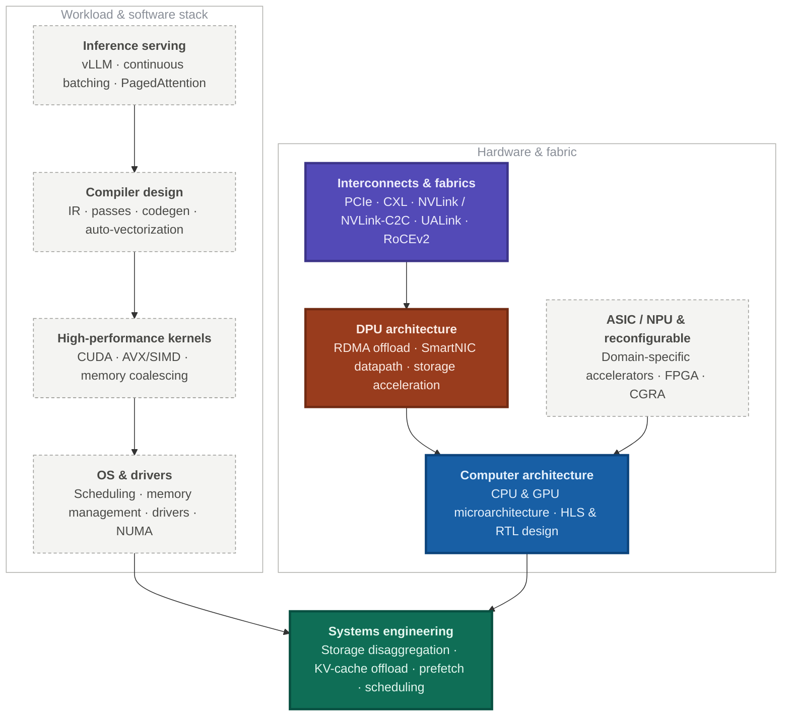

Hi 👋! I am a Hardware Engineer at MangoBoost, Inc., working on DPU system architecture and GPU-server workload analysis. What I care about is how machines are wired together and what that costs the workload running on them: the interconnects and fabrics — PCIe, CXL, RoCEv2 — the programmable devices that sit on them, and the system stack that has to make all of it usable. My day-to-day is the full path from an application workload down to the silicon that runs it, and most of it lives in making that path scale: across the network with RDMA and NVMe-over-RDMA for I/O acceleration and storage disaggregation, and within a node through prefetch, offload, and hardware-software co-design.

Before that, I was a graduate student pursuing an MS in the Department of Electrical and Computer Engineering by research under the supervision of **[Prof. Callie Hao](https://sites.gatech.edu/ece-callie/)** at Georgia Tech's **[SHARC Lab](https://sharclab.ece.gatech.edu)**.

In addition to my academic pursuits, I enjoy playing games, watching Formula 1, exploring history, and being an avid aviation enthusiast.

## Research Interests

My **primary** interests are interconnects and fabrics (PCIe, CXL), DPU architecture, systems engineering, and computer architecture — CPU and GPU microarchitecture together with the hardware design that realizes it. The **supporting** areas below are the ones I lean on to get there: the inference stack — the serving framework, the compiler that lowers it, and the kernels it ends up running — defines the workload, the OS and drivers decide how that workload reaches the hardware, and accelerator and reconfigurable design is where it lands.

Solid boxes are primary interests, dashed are supporting. Click any box to open its details.

Browse all focus areas as a list

<h3>Primary Interests</h3>

  <h4>Interconnects &amp; Fabrics</h4>
  <ul>
    <li><b>PCIe</b> — Gen5/Gen6 links, DMA engines, endpoint and root-complex behavior</li>
    <li><b>CXL</b> — memory expansion and pooling, type-2/type-3 devices, coherence</li>
    <li><b>NVLink / NVLink-C2C, UALink</b> — scale-up accelerator fabrics and topologies</li>
    <li><b>RoCEv2, NVMe-over-RDMA</b> — scale-out I/O and storage disaggregation</li>
  </ul>

  <h4>DPU Architecture</h4>
  <ul>
    <li>RDMA offload and networking datapath design</li>
    <li>SmartNIC programmability — what belongs on the device vs. the host</li>
    <li>Storage and network acceleration, on-the-fly processing in the data path</li>
  </ul>

  <h4>Systems Engineering</h4>
  <ul>
    <li><b>Across the network</b> — storage disaggregation, KV-cache offload, model offload to SSDs</li>
    <li><b>Within the node</b> — weight prefetch, scheduling, prediction algorithms</li>
    <li>Workload characterization and end-to-end benchmarking of the deployed stack</li>
  </ul>

  <h4>Computer Architecture</h4>
  <ul>
    <li><b>CPU</b> — pipeline, cache hierarchy, branch prediction, NUMA effects</li>
    <li><b>GPU</b> — SM, tensor cores, HBM, NVLink and PCIe attachment</li>
    <li><b>Hardware design</b> — HLS, C-to-RTL, Verilog/SystemVerilog, timing closure</li>
    <li>Hardware-software co-design and interconnection network optimization</li>
  </ul>

<h3>Supporting Areas</h3>

  <h4>Inference Serving</h4>
  <ul>
    <li><b>Serving stacks</b> — vLLM, continuous batching, PagedAttention, tensor parallelism</li>
    <li><b>AI agents</b> — session profiling, tool-call latency, offloading strategies</li>
    <li>On-prem and sandboxed deployment, framework benchmarking</li>
  </ul>

  <h4>High-Performance Kernels</h4>
  <ul>
    <li><b>GPU</b> — CUDA, warp scheduling, memory coalescing</li>
    <li><b>CPU</b> — AVX/SIMD vectorization, cache-aware data layout</li>
  </ul>

  <h4>Compiler Design</h4>
  <ul>
    <li>IR, passes, codegen, auto-vectorization</li>
    <li>Hardware compilers — mapping workloads onto accelerators</li>
  </ul>

  <h4>OS &amp; Drivers</h4>
  <ul>
    <li>Process/thread scheduling, memory management, NUMA</li>
    <li>Device drivers — the seam between the fabric and the software stack</li>
  </ul>

  <h4>ASIC / NPU &amp; Reconfigurable</h4>
  <ul>
    <li><b>Domain-specific accelerators</b> — sparse and dense dataflow design</li>
    <li><b>FPGA</b> — routing, placement, and timing optimization</li>
    <li><b>CGRA</b> — reconfigurable interconnects, dynamic partial reconfiguration</li>
  </ul>

### Contact

- **Email:** [sharmakarthikeya6@gmail.com](mailto:sharmakarthikeya6@gmail.com)
- **LinkedIn:** [linkedin.com/in/karthikeyasharma16](https://www.linkedin.com/in/karthikeyasharma16/)
