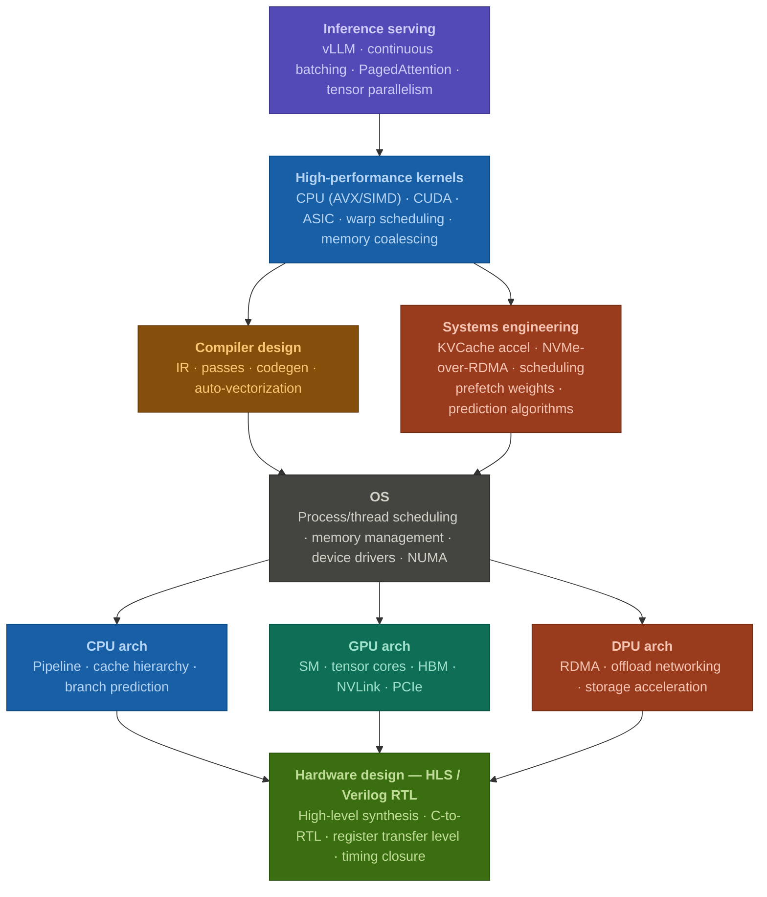

[Download the PDF résumé](/pdf/resume.pdf) · [LaTeX source](/tex/resume.tex)

## General Information

|  |  |
| --- | --- |
| **Full name** | Karthikeya Sharma M |
| **Email** | [sharmakarthikeya6@gmail.com](mailto:sharmakarthikeya6@gmail.com) |
| **Languages** | English (fluent), Hindi (fluent), Tamil (native), Telugu (fluent) |
| **Socials** | [LinkedIn](https://www.linkedin.com/in/karthikeyasharma16/) · [GitHub](https://github.com/KarthikeyaSharma16) · [Google Scholar](https://scholar.google.com/citations?user=O4Tya_YAAAAJ&hl=en) · [Merit Pages](https://meritpages.com/KarthikeyaSharma16) |

I am a Hardware Engineer at MangoBoost, Inc., working on DPU system architecture and GPU-server workload analysis. I care about the full path from an application workload down to the silicon that runs it: inference serving and agents at the top, then the compilers, operating system, and kernels beneath them, down to the CPU, GPU, DPU, ASIC, and NPU architectures they execute on. Most of my work lives in making that stack scale — across the network with RDMA (RoCEv2) and NVMe-over-RDMA for I/O acceleration, and within a node through prefetch, offload, and hardware-software co-design.

## Research Interests

Compiler, OS, Kernel design, Inference serving, Systems Engineering, and Architecture.

### Focus Areas

  <h4>Application Workloads &amp; Deployments</h4>
  <ul>
    <li><b>Inference serving</b> — vLLM, continuous batching, PagedAttention, tensor parallelism</li>
    <li><b>AI agents</b> — session profiling, tool-call latency, offloading strategies</li>
    <li>On-prem and sandboxed deployment, framework benchmarking</li>
  </ul>

  <h4>Compilers, OS &amp; Kernels</h4>
  <ul>
    <li><b>Compiler design</b> — IR, passes, codegen, auto-vectorization</li>
    <li><b>OS</b> — process/thread scheduling, memory management, device drivers, NUMA</li>
    <li><b>Kernels</b> — CPU (AVX/SIMD), CUDA, warp scheduling, memory coalescing</li>
  </ul>

  <h4>Systems Engineering — Scalability</h4>
  <ul>
    <li><b>Across the network</b> — RDMA (RoCEv2), NVMe-over-RDMA for I/O acceleration, storage disaggregation</li>
    <li><b>Within the node</b> — weight prefetch, KV-cache acceleration, offload, prediction algorithms</li>
  </ul>

  <h4>Processor &amp; Accelerator Architecture</h4>
  <ul>
    <li><b>CPU</b> — pipeline, cache hierarchy, branch prediction</li>
    <li><b>GPU</b> — SM, tensor cores, HBM, NVLink, PCIe</li>
    <li><b>DPU</b> — RDMA, networking offload, storage acceleration</li>
    <li><b>ASIC &amp; NPU</b> — domain-specific accelerator design</li>
  </ul>

  <h4>Hardware-Software Co-design</h4>
  <ul>
    <li>Sparse and dense dataflow accelerators — algorithm-to-hardware design</li>
    <li>Programming model (workload mapping)</li>
    <li>Interconnection network optimization for distributed training and inference</li>
  </ul>

  <h4>Reconfigurable Architectures</h4>
  <ul>
    <li><b>FPGA</b> — routing, placement, and timing optimization</li>
    <li><b>CGRA</b> — reconfigurable interconnects, dynamic partial reconfiguration</li>
  </ul>

## Education

  

    MS in Electrical and Computer Engineering
    Aug 2023 – May 2025
  

  

    Georgia Institute of Technology, Atlanta, GA
    GPA 3.77/4
  

  

    <svg width="15" height="15" viewBox="0 0 24 24" fill="none" stroke="currentColor" stroke-width="2.2" stroke-linecap="round" stroke-linejoin="round" aria-hidden="true">
      <path d="M12 2 4 5v6c0 5 3.4 9.4 8 11 4.6-1.6 8-6 8-11V5l-8-3z"></path>
      <path d="m9 12 2 2 4-4"></path>
    </svg>
    Degree verified by Georgia Tech, Class of 2025 —
    <a href="https://meritpages.com/KarthikeyaSharma16">view on Merit Pages</a>
  

  

    B.Tech in Electronics and Communication Engineering
    Jul 2019 – May 2023
  

  

    SRM Institute of Science and Technology, Chennai, India
    GPA 9.83/10
  

## Technical Skills

| | |
| --- | --- |
| **Coding** | C/C++, CUDA C, *Scripting* (Python, Bash, TCL), *RTL* (Verilog, SystemVerilog), High-Level Synthesis |
| **Tools** | Vivado, Vitis HLS, ModelSim, Verdi, VCS |
| **Agents** | Claude Code, OpenCode |
| **Protocols** | AXI (AXI-MM, AXIS, AXI-Lite), QDMA, PCIe |
| **Libraries** | OpenMP, OpenMPI, NeMo Guardrails |
| **Coursework** | Advanced Computer Architecture, Hardware-Software Co-Design for ML Systems, Parallel Programming for FPGA, Advanced Programming Techniques, Machine Learning, VLSI Design, Microprocessors & Microcontrollers |

## Work Experience

  

    Hardware Engineer
    Jul 2025 – Present
  

  

    MangoBoost, Inc. — Bellevue, WA
    Current
  

  

    

      System Architecture &amp; Implementation — Hardware Development Group
      Jul 2025 – Dec 2025
    

    <ul>
      <li>Served as core architect of Data Plane Studio (DPS) for the <a href="https://www.mangoboost.io/products/hardware/mango-boostx-tm"><b>Mango BoostX 400G DPU</b></a>, enabling scalable reuse of a single hardware architecture across multiple use cases (RoCEv2 AI, NVMe-over-RDMA, NVMe-over-TCP Initiator).</li>
      <li>Owned <b>PCIe and DMA</b> feature development and reset-tree architecture, resolving critical hardware functional issues prior to delivering alpha-verified milestones for the MangoBoost–SK Hynix joint project.</li>
      <li>Built automation scripts to streamline DPU testing, and enhanced the CI/CD workflow for sanity testing — covering synthesis/implementation checks, functional verification, and network performance tests.</li>
      <li>Extended the testing pipeline by authoring SKILLS.md definitions and configuring coding agents (OpenCode, Claude Code) to autonomously perform DPU validation runs alongside existing automation.</li>
      <li>Built an IP-protected package for DPS that encrypts and obfuscates proprietary designs; authored user documentation for early adopters to accelerate their IP development.</li>
    </ul>
  

  

    

      GPU Server Taskforce — Workload Analysis &amp; Performance Optimization
      Jan 2026 – Present
    

    <ul>
      <li>Characterized application-level GPU server workloads, benchmarking end-to-end performance to expose bottlenecks and guide optimization targets across the software–hardware stack.</li>
      <li>Benchmarked AI agent workloads, profiling coding-agent sessions to identify <b>high tool-call volume</b> as a key latency driver, then proposed tool-call offloading strategies to reduce it with a PoC.</li>
      <li>Evaluated on-prem deployment strategies for application workloads (guardrails, coding agents) to inform infrastructure and performance decisions.</li>
      <li>Built a sandboxed environment for running Claude Code and an AI Benchmarker that evaluates any framework within the sandbox (e.g., vLLM and llama.cpp performance on Strix Halo) and reports results.</li>
      <li>Investigated NVMe-over-RDMA for storage-disaggregated use cases (e.g., model offloading to SSDs).</li>
    </ul>
  

## Projects

  

    Cryptonite: Scalable Accelerator Design for Cryptographic Primitives
    Jan 2024 – May 2025
  

  

    <a class="pill" href="https://arxiv.org/abs/2505.14657">Paper ↗</a>
  

  <ul>
    <li>Built Cryptonite, an HLS-based design-space-exploration toolchain that compiles formally verified straight-line C from Fiat-Cryptography into <b>hundreds of correct-by-design Pareto-optimal</b> designs for elliptic-curve primitives.</li>
    <li>Designed an <b>analytical QoR estimator</b> that predicts latency/DSP usage during pre-synthesis, making exhaustive pragma exploration tractable.</li>
    <li>Achieved <b>89% lower resource usage</b> and <b>54% lower latency</b> compared to the straight-line code baseline.</li>
  </ul>

  

    APEX: Automated Platform for Exploring Collective Communication Systems
    Apr 2024 – Dec 2024
  

  

    <a class="pill" href="https://github.com/davendramaharaj1/apex_tacos">Code ↗</a>
  

  <ul>
    <li>Prototyped <b>APEX</b>, an automated toolchain for analyzing network configurations and collective algorithms for ML workloads via design space exploration, revealing 64% of the workload to be bandwidth- and topology-dependent.</li>
    <li>Streamlined collective algorithm synthesis by translating TACOS outputs to MSCCLang IR and Chakra Execution Traces, bypassing ASTRA-Sim's system layer and reducing engineering effort by <b>10×</b>.</li>
    <li>Enabled heterogeneous topology translation and an interactive visualizer for analysis of GPU network collective flows and patterns for congestion and switch modeling.</li>
  </ul>

  

    Federated Training and Profiling of Large-Scale ML Models
    Mar 2024 – Apr 2024
  

  <ul>
    <li>Implemented single and distributed GPU training (2 GPUs) of a GPT-like (gpt2-large architecture) model on an NVIDIA RTX 6000 server using Megatron-LM, utilizing tensor, data, and pipeline parallelism.</li>
    <li>Profiled training with TensorBoard, showing tensor parallelism achieving a <b>1.84× speedup</b> over pipeline parallelism.</li>
  </ul>

  

    Performance-Aware Accelerator Design for ML Workloads
    Feb 2024 – Mar 2024
  

  <ul>
    <li>Conducted DSE using Scale-Sim to optimize systolic array configurations for the LeNet CNN, achieving 57% average mapping efficiency for operators while evaluating performance trade-offs across dataflow configurations.</li>
    <li>Developed a mapping strategy (84.375% mapping efficiency) to mitigate faulty processing elements in a weight-stationary 3×3 systolic array, optimizing GEMM computation latency (54 cycles).</li>
  </ul>

  

    MIPS CPU and CMP Memory Simulator
    Sep 2023 – Dec 2023
  

  <ul>
    <li>Developed a 5-stage (8-pipe) MIPS CPU simulator with out-of-order execution, GShare branch prediction, and an optimized cache hierarchy, reducing <b>CPI by 50%</b> and latency by 10%.</li>
    <li>Engineered a dual-core simulator with L1 and shared L2 caches (LRU &amp; random eviction) and DRAM, optimizing L2 utilization via SWP &amp; DWP for a 0.85% performance gain.</li>
  </ul>

## Teaching Experience

  

    Graduate Teaching Assistant — CS 6340, Software Analysis &amp; Testing
    Aug 2024 – Dec 2024
  

  

    School of Computer Science, Georgia Institute of Technology — Atlanta, GA
  

  <ul>
    <li>Delivered a class session for 35 students on the SVF framework, including a live tutorial and debugging strategies.</li>
    <li>Conducted weekly office hours mentoring students on assignments and the final project. Developed 21 test cases for the project and evaluated students' implementation strategies for technical rigor.</li>
  </ul>

## Academic Achievements

- Secured 5th academic position throughout B.Tech, awarded by the Department of ECE, SRM University, May 2023.
- Secured the Best Project Runner-Up award for innovation in "Terahertz Imaging for Aerospace Applications" at the COMSPRO Capstone Project Expo 2023, SRM University.
- Three-time successive recipient of the **Performance-Based Scholarship**, annually awarded by the Department of ECE, SRM University, 2021–23.

## Publications

  
Oct 2025

  

    
Ultra-high Information-content Chemical Imaging with Broadband Coherent Anti-Stokes Raman and Two-photon Fluorescence Lifetime Microscopy

    

      Xu, H., Chen, W., Dixon, J. Z., Maharaj, D. S., Sharma, K. M., Audier, X., Cicerone, M. T. 
      Journal of Visualized Experiments (224), e68845 · doi:10.3791/68845
    

  

  
Jul 2025

  

    
Cryptonite: Scalable Accelerator Design for Cryptographic Primitives and Algorithms

    

      K. S. Maheswaran, C. Bossut, A. Wanna, Q. Zhang, C. Hao 
      IEEE 36th International Conference on Application-specific Systems, Architectures and Processors (ASAP), Vancouver, BC · pp. 17–24 · doi:10.1109/ASAP65064.2025.00013
    

  

  
May 2023

  

    
Terahertz Imaging for Aerospace Applications

    

      K. S. M., A. Rao, K. Kumar, T. R. Rao 
      International Conference on Wireless Communications Signal Processing and Networking (WiSPNET), Chennai, India · pp. 01–05 · doi:10.1109/WiSPNET57748.2023.10134245
    

  

